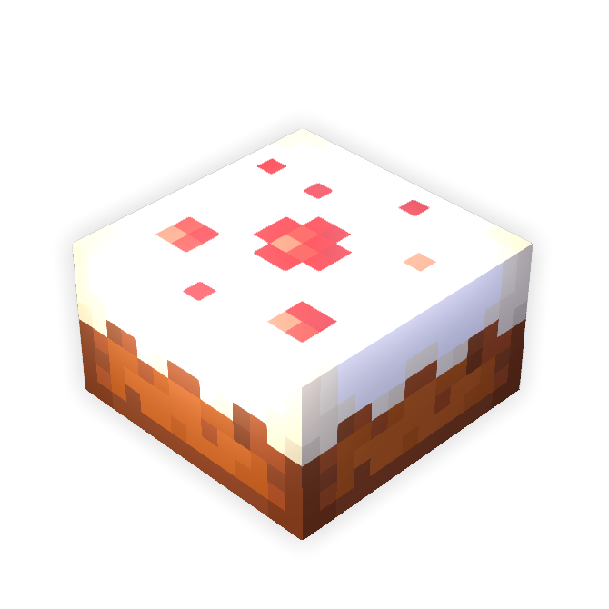

<div align=center>
 
 <br>
 
 <!---->
 
 
</div>

# CakeLang
CakeLang is an *open source* Minecraft data pack *development framework* with a built in CakeLang *scripting language* transpiler!
You can build *generative and dynamic data packs* using *C#* which has built in plugin support through *nuget*!
<div align=center>
 <p>Start enjoying data pack development now 🎂🎉</p>
</div>

> ### Install
> Install the framework from the link below.
> <a href="https://www.nuget.org/packages/CakeLang"></a>

# Usage

## Examples

### 1. Basic Setup

Source code:

```c#
using CakeLang;

namespace CakeLangDemo
{
    class Program
    {
        static void Main(string[] args)
        {
            DataPack demoPack = new DataPack("Demo Pack", "A demonstration of CakeLang!", "demopack");
            // Code ...
            demoPack.CompileAndInject("CakeLang Demo");
        }
    }
}
```
